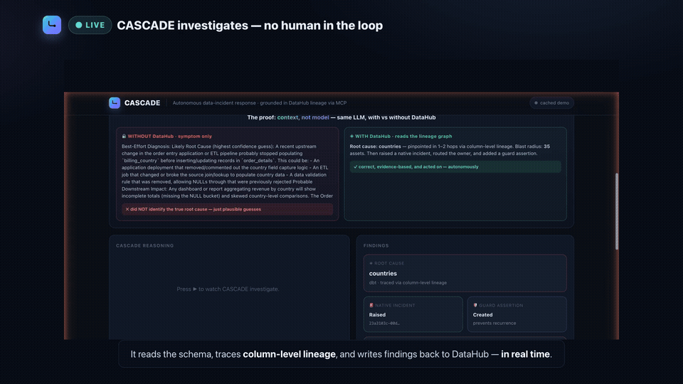
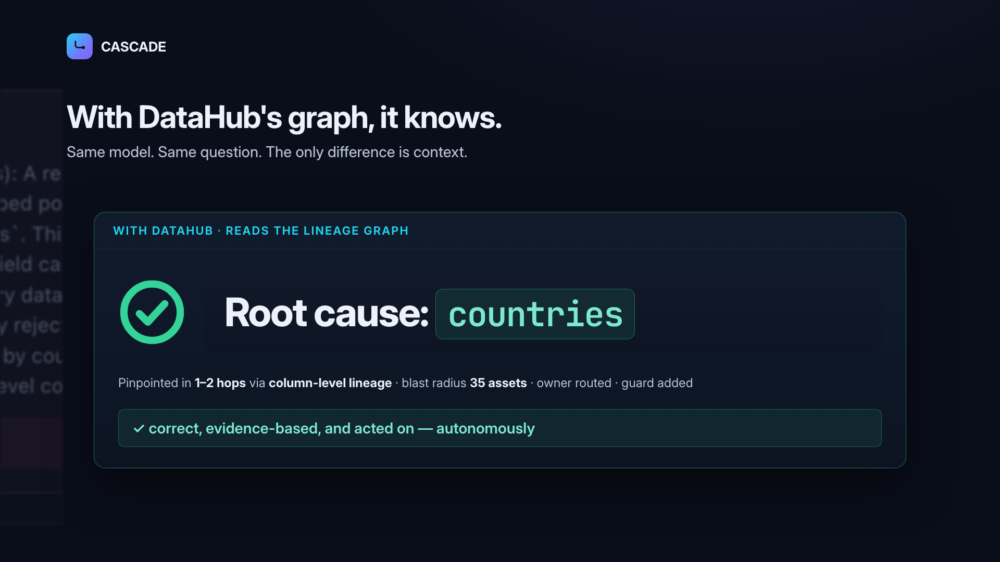
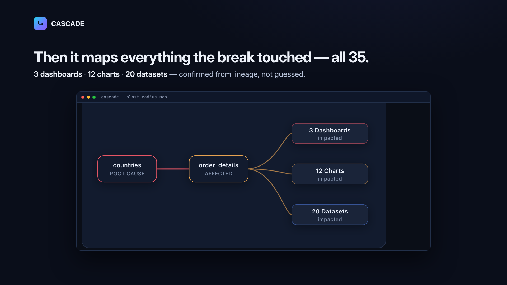
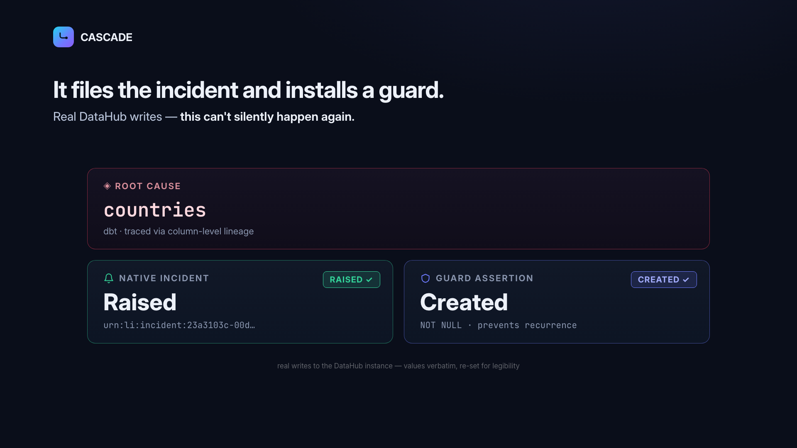
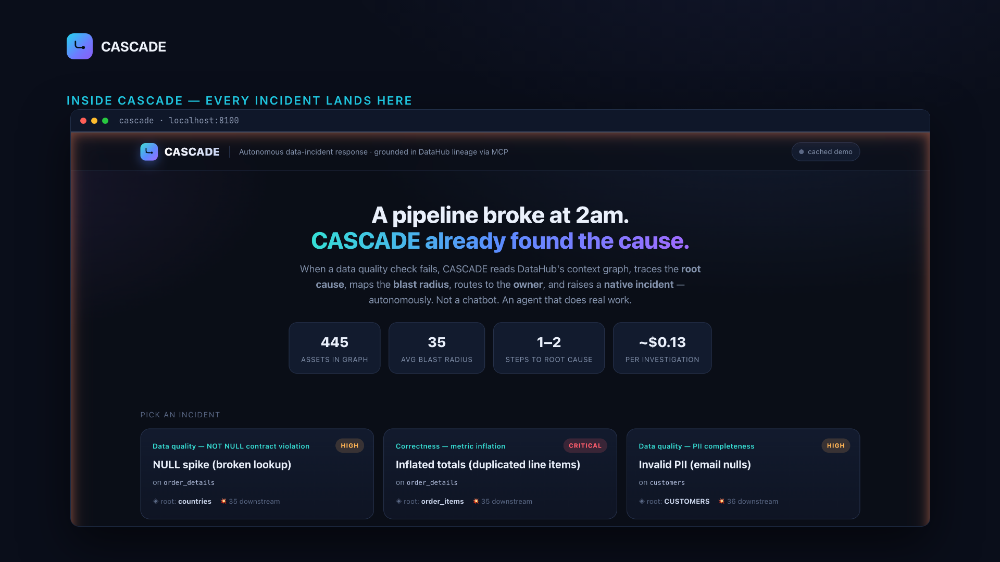

# CASCADE — DataHub-Grounded Incident Response

[](LICENSE)
[](https://github.com/Biniyoyo/Cascade/actions)


> **CASCADE uses DataHub's Context Graph via the [MCP Server](https://github.com/acryldata/mcp-server-datahub) to read lineage, schema, and ownership — and writes back via DataHub's native Incidents API, plus a guard assertion and owner routing.** It is an AI agent that does real on-call work: when a data-quality check fails, CASCADE finds the root cause, maps the blast radius, raises a real incident, and proposes the fix — **autonomous investigation, propose-first write-back.**

**[▶ Watch the 2:52 demo](https://youtu.be/3Zb7RKR61JQ)** · **[🖥 Try the war room](https://biniyoyo.github.io/Cascade/)** · **Track:** Agents That Do Real Work · **License:** Apache-2.0

*The hosted war room replays the recorded investigations — step-by-step reasoning, lineage, blast radius, the generated report — with no setup. Live runs against a real DataHub are local-only (they need your DataHub + an API key); rebuild the static site with `python scripts/build_static.py`.*



## The problem

A column silently breaks at 2 a.m. Which dashboards are now wrong? What upstream change caused it? Who owns the fix? Today an engineer answers these by hand — reading lineage, clicking through the catalog, guessing — for hours, while wrong numbers reach executives.

## The thesis, measured

> *"This is not an LLM problem. It is a context problem. Without context, you're paying your agents to guess."* — DataHub

CASCADE turns that into a number — measured at two model tiers, same model in both arms of each:

| | without DataHub | with DataHub (lineage via MCP) |
|---|---|---|
| claude-haiku-4.5 · 5 runs × 3 scenarios | **0 / 15** | **15 / 15** |
| claude-sonnet-5 · 1 run × 3 scenarios | **0 / 3** | **3 / 3** |

**Admissible result: 0/10 → 10/10.** All 18 runs passed, but we audited our own
eval and found that a reset bug left a prior rep's annotation on the root-cause
asset in 8 of them — those are published but excluded from the headline
(`python scripts/audit_contamination.py`). Native incidents and guard
assertions: 18/18. Full protocol, the bug write-up, per-scenario table, and raw
traces: [docs/eval.md](docs/eval.md).

*Graded structurally: a run counts only if the agent's `update_description` write targets the ground-truth root-cause **table** (accepted at any layer of its ingestion chain, never the affected dataset). Prose mentions never count. Hint-free graph reset before every rep — verified per run, not assumed. Re-score
offline: `python scripts/regrade.py` (canonical replays **and** all 18 raw runs,
split by contamination).*



## What CASCADE does (autonomously)

1. **Triage** — reads the failing dataset's schema (`list_schema_fields`) to locate the affected column.
2. **Root cause** — traces upstream **column-level lineage** (`get_lineage`) to the **evidence-backed likely root cause** — verified facts and inference kept explicitly separate in the report.
3. **Blast radius** — traces downstream (`get_lineage`) to enumerate every impacted dashboard, chart, and dataset.
4. **Route** — reads ownership (`get_owners`) and **assigns the incident** to the responsible team/person. Routing is a property of the graph, not of the model remembering to ask for it: if the agent doesn't name assignees, `raise_incident` falls back to the asset's own owners (technical owner → steward → business owner), so every incident lands on someone real (`tests/test_tools_routing.py`).
5. **Write back** — raises a **native DataHub incident**, annotates the root-cause asset, and registers a **native guard assertion** for your assertion runner to evaluate (registration is what CASCADE does today; native run-evaluation wiring is roadmap).
6. **Alert** — drafts a ready-to-send owner notification with root cause, blast radius, and the fix.
7. **Propose repair** — generates a reviewable remediation artifact: a **dbt schema test + patch proposal** tied to the root-cause lineage and routed owner, human-approval gated (`scripts/propose_fix.py` → `examples/remediation/`). Nothing is auto-applied.




## How CASCADE uses DataHub (the heart of the project)

| DataHub capability | CASCADE call | Why it matters |
|---|---|---|
| Context graph search | `search` | Locate assets in the graph |
| Schema | `list_schema_fields` | Find the failing column, its type, NOT NULL / PII status |
| **Lineage (column-level)** | `get_lineage` | **Root cause + blast radius — the core reasoning substrate** |
| Ownership | `get_owners` | Route the incident to the right team |
| Entity verification | `get_entities` | Verify metadata claims before trusting them (see Security) |
| **Native Incidents API** | `raiseIncident` (our tool) | **Write a real incident back — closing the loop** |
| Descriptions | `update_description` | Annotate the root-cause asset |
| **Data-quality assertions** | `upsertCustomAssertion` (our tool) | **Register a guard against recurrence** |

*Also available to the agent (not exercised by the showcase traces): `get_lineage_paths_between`, `get_dataset_queries`.*

The demo graph is DataHub's **showcase-ecommerce** datapack — **1,049 entities with lineage** (445 of them datasets, charts & dashboards) across Postgres, Kafka, S3, Snowflake, dbt, Looker, Tableau, Power BI and more.

## Why the native-incident write-back is novel

The DataHub **MCP server exposes no incident-writing tool** — its writes stop at tags, terms, owners, and descriptions. CASCADE adds `raise_incident` (wrapping DataHub's native `raiseIncident` GraphQL mutation) and `create_assertion` (via `upsertCustomAssertion`). So CASCADE **closes a loop DataHub's own agent stack cannot today** — The incident tools (`raise_incident`, `update_incident_status`) are **proposed upstream in [acryldata/mcp-server-datahub#147](https://github.com/acryldata/mcp-server-datahub/pull/147)**; the guard-assertion write uses DataHub's native `upsertCustomAssertion` GraphQL API directly.

## Security: the catalog is untrusted input

Agents that read shared metadata can be **prompt-injected through the catalog itself**. CASCADE's procedure treats every description as untrusted data: when we planted a fake "incident note" in an asset's description pointing at a bogus root cause, CASCADE **flagged it and verified via `get_entities` before acting**. Reproduce it:

```bash
python scripts/plant_injection.py   # seeds the poisoned description into your local graph
python run_incident.py              # watch CASCADE distrust-and-verify it
```

## Quickstart — the $0 path first (no keys, no Docker)

```bash
git clone https://github.com/Biniyoyo/Cascade && cd Cascade
python3 -m venv .venv && source .venv/bin/activate && pip install -r requirements.txt
uvicorn app:app --port 8100         # open http://localhost:8100 — full cached demo
```

The war room replays **three complete, real incident investigations** (every tool call, the A/B, the write-back receipts) from cached traces — no DataHub, no API key, no spend.

<details>
<summary><b>Full live setup (Docker DataHub + live agent runs)</b></summary>

```bash
# 1. DataHub (Docker) + sample lineage
python3 -m pip install 'acryl-datahub[datahub-rest]'
datahub docker quickstart                         # UI :9002 (datahub/datahub), GMS :8080
datahub datapack load showcase-ecommerce --force  # 1,049 entities with lineage

# 2. CASCADE (dev extras + agent SDK)
pip install -r requirements-dev.txt
cp .env.example .env        # set ANTHROPIC_API_KEY; local DataHub needs no token

# 3. Run the agent on one incident, or the full eval
python run_incident.py               # one live investigation
python run_incident.py --propose     # propose-only mode: prints intended writes, executes none
python run_eval.py                   # all 3 scenarios; refreshes the cached traces
```
</details>

### Point it at your own DataHub

Nothing above is specific to the demo graph. CASCADE takes any dataset URN your
DataHub knows about, on any platform, plus the symptom in plain English:

```bash
python run_incident.py \
  --urn 'urn:li:dataset:(urn:li:dataPlatform:snowflake,PROD_DB.sales.orders,PROD)' \
  --symptom 'freshness check failed — no rows loaded since 03:00 UTC' \
  --priority critical --propose
```

`--propose` is the way to meet a new catalog: CASCADE reads your real lineage,
schema and ownership, then prints the exact writes it *would* make without
executing any of them. Point it at production and read the diff before you ever
give it a write token. Config is the same `DATAHUB_GMS_URL` / `DATAHUB_GMS_TOKEN`
the DataHub MCP Server already uses.



## Reliability — and exactly how it's graded

`run_eval.py` injects 3 known-root-cause incidents (NULL spike, metric inflation, PII completeness) and grades **structurally**: a scenario passes iff the agent's `update_description` targets the ground-truth root-cause URN (`cascade/scenarios.py` → `expected_root_cause_urns`, accepted at any layer of the
ingestion chain). Result across both model tiers: **10/10 with DataHub vs 0/10 for
the no-context controls on the runs that are verifiably hint-free**, and 18/18 vs
0/18 counting every run ([docs/eval.md](docs/eval.md)). `scripts/regrade.py`
re-scores every shipped trace and `scripts/audit_contamination.py` re-checks which
runs are admissible — both offline, no API key, no DataHub.

*Honesty note: the showcase traces were recorded in a fuller development harness — you'll see auxiliary calls (e.g. shell/jq handling of oversized lineage payloads) alongside the DataHub MCP calls; the shipped `ALLOWED_TOOLS` runs the same procedure with the DataHub + CASCADE toolset.*

## Deploying this safely

Rollout tiers, audit log, and the webhook trigger are documented in [docs/deploy-safely.md](docs/deploy-safely.md): **observe** (cached replay) → **propose** (`--propose`: agent plans writes, human confirms) → **act** (allowlisted tools, per-run budget caps, `audit/audit.jsonl` write log). `POST /api/trigger` accepts an assertion-failure-style payload — the hook where DataHub's webhook/Actions event would point.

## AI + cost

- Model: Claude — **measured $0.08–$0.13/run on Haiku** (see eval), ~$0.37–$0.56 on Sonnet (the recorded showcase tier). Model-agnostic via MCP.
- Spend-capped per run (`max_budget_usd`) and per deployment (global + per-session caps).

## Open-source contributions (`oss/`)

| Contribution | Target | Status |
|---|---|---|
| `raise_incident` / `update_incident_status` MCP tools | [mcp-server-datahub](https://github.com/acryldata/mcp-server-datahub) | **filed: [PR #147](https://github.com/acryldata/mcp-server-datahub/pull/147)** (514 tests pass, 15 new) |
| `datahub-incident-response` Skill | [datahub-skills](https://github.com/datahub-project/datahub-skills) | **filed: [PR #56](https://github.com/datahub-project/datahub-skills/pull/56)** (proposal: [#55](https://github.com/datahub-project/datahub-skills/issues/55)) |
| 5 friction issues found while building (incident priority enum coercion, undocumented write headers, unbounded lineage payloads, missing incident write tools, custom-assertion UI surfacing) | mcp-server-datahub · datahub | **[#18709](https://github.com/datahub-project/datahub/issues/18709) — FIXED UPSTREAM** by maintainer PR [#18738](https://github.com/datahub-project/datahub/pull/18738) (merged). Also filed: [#153](https://github.com/acryldata/mcp-server-datahub/issues/153), [#154](https://github.com/acryldata/mcp-server-datahub/issues/154), [#18710](https://github.com/datahub-project/datahub/issues/18710), [#18711](https://github.com/datahub-project/datahub/issues/18711) — #18709 and #18711 triaged into DataHub's Linear (CAT-2748, CAT-2749) |

## Going deeper (honest roadmap on DataHub's real surfaces)

- **Event-driven trigger** — DataHub Actions-framework consumer on assertion run events → `POST /api/trigger` (today: webhook endpoint shipped, consumer not).
- **Assertion run reporting** — post `reportAssertionResult` run events so the guard assertion evaluates natively in the UI.
- **Richer incidents** — `assigneeUrns` on raise, FIELD-typed incidents scoped to the failing column, agent-driven `RESOLVED` closure once the guard passes.
- **Change detection** — timeline API diffing to catch the breaking change, not just the broken column.

## Repo map

| Path | What |
|---|---|
| `cascade/agent.py` | the agent (Claude Agent SDK + DataHub MCP + CASCADE tools) |
| `cascade/tools.py` | in-process MCP tools: `raise_incident`, `create_assertion`, `get_owners` |
| `cascade/datahub_incidents.py` | native Incidents + assertions + ownership (GraphQL) |
| `cascade/prompts.py` | the incident-response procedure (incl. untrusted-metadata rule) |
| `cascade/grading.py` · `scripts/regrade.py` | structural URN grading + offline re-scoring |
| `cascade/scenarios.py` · `run_eval.py` | the 3 scenarios (with ground-truth URNs) + eval/cache builder |
| `app.py` · `frontend/index.html` | the war-room web app (+ `/api/trigger`, audit log) |
| `scripts/plant_injection.py` | reproduce the prompt-injection defense |
| `tests/` · `.github/workflows/ci.yml` | unit tests + CI |
| `oss/` | the open-source contributions + filing guide |
| `examples/` | sample outputs (incident reports, alerts) |

**License:** [Apache-2.0](LICENSE)
